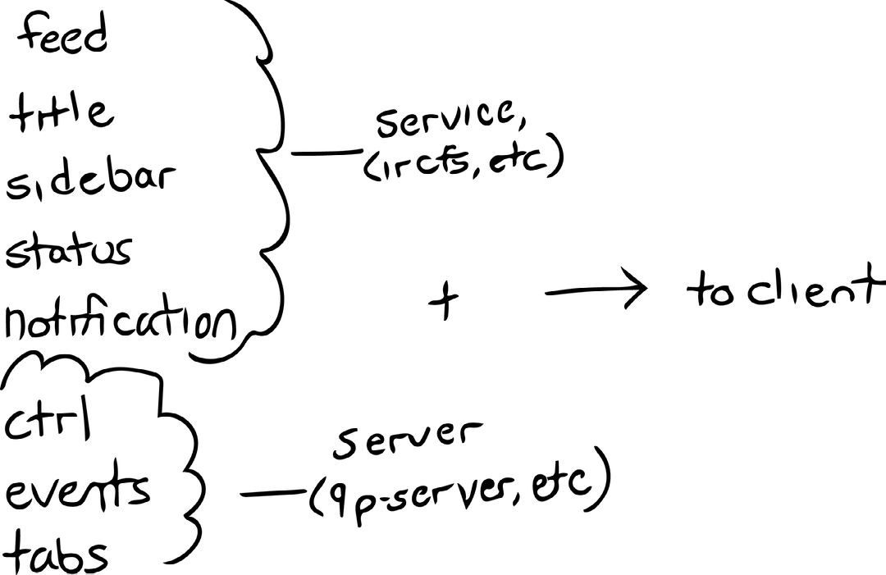
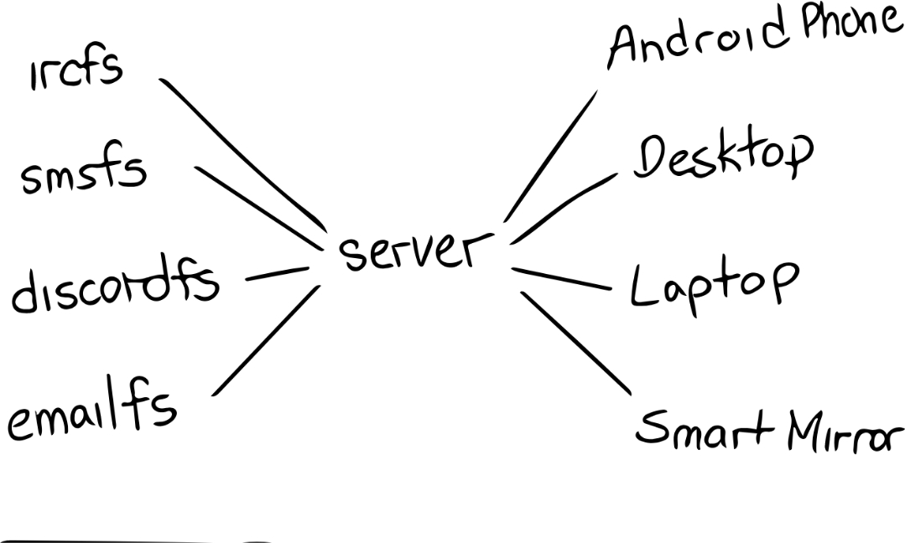

# Architectural Overview

We'll have some supplementary images in the coming weeks to help clarify this document

## Services - Directory Layout

Altid services are expressed as a directory of named files, and subdirectories of other named files. The content of any such file is markdown, described here [markdown guide](markdown.md).

A service directory is laid out as follows:

```
<working dir>/
 | ctrl
 | events
 | tabs
 | list/
 | of/
 | open/
 | buffers/
```

 - `ctrl` is an append-only file that accepts commands as lines of text written to it.
 - `events` is an append-only file that the service writes to each time a file it manages is modified, deleted, or created
 - `tabs` is a list of all open, active buffers

## Services - Buffer Layout

Aside from these three files, are a set of zero or more directories, describing 'open' buffers. What that means depends on the service itself, but it can range from a pdf document, to an IRC channel, to an SMS session with a friend.

```
Inside of those directories is a subset of files, which must include:
<buffer dir>/
 | feed
 | # <or>
 | document
 | # <or>
 | stream
 | title
 | input
 | aside
 | navi
 | status
 | notification
```

 - `feed`, `document`, or `stream` is the main content of a given buffer. This normally comprises the chat backlog of a chat service, the body of a document, or a link to the underlying stream in the case of a streaming service. (more on that in future updates)
 - `title` is generally the main topic of a chat, the title of a document, and falls back to the name of the open resource.
 - `input` is an append-only file that when present, sends data to the underlying service; such as sending chat messages, or filling in input fields on a form*.
 - `aside` is reserved for information related to the buffer, such as a list of usernames in a chat
 - `navi` is reserved navigation elements, such as a site index or Table of Contents
 - `status` shows errors with issued commands, as well as any information about the particular runtime status of the buffer. Chat clients may show user/channel modes, documents may display parsing errors, etc.
 - `notification` is used to signify that the service wishes to signify clients of an important occurance, such as an @mention in a chat client

## Services - Interaction With Clients And Servers
These individual pieces are combined with a ctrl file, events file, and tabs file from the root of the directory by an Altid server, such as 9p server.
The result is served, somewhat modified to an Altid client for drawing.


## Servers

A server walks the working directory to find any services - that is, directories which match the above structure. It then aggregates the content of the events files of any found services, and orchestrates client access to them. In the case of 9p-server, it presents a single, flat directory describing a single buffer, as follows:

```
<client dir>/
 | tabs
 | title
 | sidebar
 | ctrl
 | input
 | notification
 | event
 | feed
 | # <or>
 | document
 | # <or>
 | steam
```

`title`, `sidebar`, and `input` are all optional.

 - `ctrl` is an append-only file which wraps the ctrl file of the underlying service, and intercepts writes for any control token it recognizes.
 - `tabs` is an aggregated list of all tabs pertaining to services the client is connected to. It is marked up to signify when there is new content on a particular, or a highlight by the server.
 - `event` is an append-only file which wraps the services' events files, and will list events only pertaining to the currently connected buffer.
 - `notification` is a file which occurs only when a service wishes to signify some event to the client, and will be populated only if a notification file exists for the given buffer.

## Servers - Client Connections



A server in Altid multiplexes connections to the underlying state. That is to say, each client may have a unique view from other connected clients. Different clients can be connected to different services, be viewing a different buffer, or the same services and/or buffer. Any content updated will be sent to all clients where applicable.

## Clients

Clients read the above files, which are formatted in [Altid-flavoured markdown](markdown.md). For a given element, they draw up a UI in the manner they see fit.
For example:
 - A `ctrl` file could be expressed as a nested menu, as the contents iterate available commands, and command history. 
 - A `status` file could be expressed as a statefully displayed toast when scrolling on a phone, or a persistent bar on a terminal client
 - A `sidebar` could slide out when requested, or be persistently shown

Note: None of these are considered authoritative, and by no means is this an exhaustive list. A client first and foremost should be designed in a manner that makes sense for where, how, and on what it is used. 

## Finally

If you find limitations in any of the design to express a service well, please open an issue!
If you find that you don't have enough information to thoroughly describe a service in a client implementation, again; please open an issue!

Aside from the author: 
The goal of Altid is to present data across a gamut of devices in a usable manner, in ways that work well with a given task or use case. To meet this goal, accurate, faithful recreation of a designers' work simply isn't possible. This is unfortunate, as I hold high respect for graphical designers, and have often marvelled at the amazing creations people have produced over the years. 
